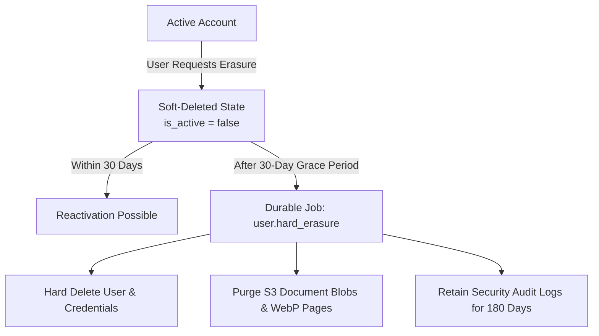

# Life Admin OS — Data Retention & DPDP Compliance Schedule

**Document Version:** 1.0  
**Effective Date:** September 2026  
**Statutory Basis:** Digital Personal Data Protection Act, 2023 (DPDP Act, Section 8, 12, 13) & CERT-In Cybersecurity Directives

---

## 1. Overview and Purpose

Life Admin OS operates as a **Data Fiduciary** for Indian families storing legal, financial, property, and civil documents. This schedule defines the retention, portability, and erasure policies governing personal and family data.

---

## 2. Consent Specification & Purpose Registry

Every user's consent is captured at registration (`POST /api/v1/auth/register`), versioned against the active privacy notice, and stored in the `consents` table:

| Purpose Key | Description | Mandatory | Revocable | Effect of Withdrawal |
|---|---|---|---|---|
| `service_delivery` | Core vault storage, tenancy isolation, and multi-user family registry. | Yes | No (requires account erasure) | Account soft-deleted and queued for erasure. |
| `ai_processing` | Optical Character Recognition, LLM-based classification, fact extraction, and assistant retrieval. | Optional | **Yes** (`POST /api/v1/me/consents/withdraw`) | Future model calls are stopped. Document status marked `ai_consent_withdrawn`. Existing verified facts remain preserved. |
| `email_reminders` | Automated deadline alerts, expiry notifications, and weekly email digests. | Optional | **Yes** | Reminders muted; deadlines remain tracked in user dashboard. |

---

## 3. Data Retention Lifecycle

### 3.1 Retention Periods by Category

| Data Category | Tables / Storage | Retention Period | Statutory / Operational Justification |
|---|---|---|---|
| **Account Credentials** | `users`, `refresh_tokens` | Active + 30-day grace period | Authentication and session recovery window. |
| **Family Registry** | `families`, `family_members` | Active + 30-day grace period | Tenancy and relational family graph maintenance. |
| **Stored Documents** | S3 Private Bucket (`documents/*`) | Active + 30-day grace period | Primary service storage. Hard-deleted after grace period. |
| **Extracted Facts** | `extracted_fields`, `document_chunks` | Active + 30-day grace period | Derived document intelligence. Purged on hard delete. |
| **Deadlines & Reminders** | `deadlines`, `reminders`, `reminder_deliveries` | Active + 30-day grace period | Calendar and renewal tracking. |
| **Security Audit Logs** | `audit_logs` | **180 Days** | **Mandatory statutory retention** under Indian Computer Emergency Response Team (CERT-In) directions for cybersecurity incident investigation. |
| **Financial / Billing Records** | Invoicing records | **8 Years** | Mandatory under Section 44AA of Income Tax Act and GST Regulations. |

---

## 4. Data Principal Rights Implementation

### 4.1 Right to Data Portability (`GET /api/v1/me/export`)
- Users may request an export of all personal data, family records, extracted fields, and uploaded files.
- The system generates a standard ZIP archive containing:
  - `manifest.json`: Machine-readable, structured JSON export of profile, consents, family links, and extracted facts.
  - `documents/`: Complete original uploaded PDFs and images.
- Delivered via an S3 pre-signed URL with a strictly enforced **24-hour expiration** (`86,400 seconds`).

### 4.2 Right to Correction (`POST /fields/{id}/verify`)
- Under the Provenance Principle, AI-extracted data is unverified until human review.
- Users can correct, dispute, or overwrite any field value. AI extractions never overwrite human-verified values.

### 4.3 Right to Erasure (`DELETE /api/v1/me`)
- Immediate soft-deletion (`is_active = false`).
- All active refresh tokens are immediately revoked.
- An erasure request row is logged in `data_requests` with status `grace_period`.
- A background worker job (`user.hard_erasure`) is enqueued for execution after **30 days**.
- If the user does not cancel during the grace period, all documents, vectors, embeddings, and credentials are permanently purged from PostgreSQL and MinIO.

### 4.4 Right to Nominate
- Under Section 14 of the DPDP Act, users may designate family members (`FamilyMember.relationship_label`) to inherit vault access and administrative rights in the event of death or incapacity.
